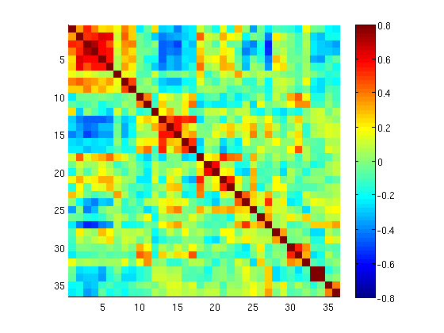

Processing BOLD Data
--------------------

Scenario: You collected some BOLD data and you're interested in functional connectivity.

This example will walk you through the typical functional connectivity pipeline in the 4dfp suite - generic BOLD pre-processing, fcMRI
pre-processing, and seed-based correlation.

Preparing your DICOMs
+++++++++++++++++++++

If you haven't already downloaded your data, see :ref:`cnda_download`.

Once you have your data downloaded and transferred to your project directory, you will start by sorting your dicoms.
How to run this will depend on the dicom directory structure::

    $ cd /path/to/project
    $ cd NEWT002_s1
    $ ls
    SCANS

    $ ls SCANS

If :code:`SCANS/` contains a flat list of DICOMs, you will use :ref:`dcm_sort`::

    $ dcm_sort SCANS

If :code:`SCANS/` contains number directories, you will use :ref:`pseudo_dcm_sort`::

    $ pseudo_dcm_sort.csh SCANS

This will create :code:`study` folders for each of the scans downloaded from CNDA, as well as a :code:`SCANS.studies.txt` file that
contains the mapping of study number to CNDA series description ::

    $ ls
    SCANS               study10     study21     study25     study29
    SCANS.studies.txt   study14     study23     study27

    $ cat SCANS.studies.txt
    10   tfl3d1_16ns    ABCD_T1w_MPR_vNav                                   176
    14   spc_314ns      ABCD_T2w_SPC_vNav                                   176
    21   epse2d1_90     SpinEchoFieldMap_AP_2p4mm_64sl                        3
    23   epse2d1_90     SpinEchoFieldMap_PA_2p4mm_64sl                        3
    25   epfid2d1_90    fMRI_AP_2p4mm_MB4_tr1230_te33                       250
    27   epfid2d1_90    fMRI_AP_2p4mm_MB4_tr1230_te33                       250
    29   epfid2d1_90    fMRI_AP_2p4mm_MB4_tr1230_te33                       250

Now that we have our DICOM data sorted, we are almost ready to begin BOLD pre-processing. In the 4dfp suite, this is done via
:ref:`cross_bold_pp`. Unless you are processing data for a study that was using an older version of cross bold, you should always use the
latest version.

Generic BOLD pre-processing
++++++++++++++++++++++++++

In order to run cross bold, we first need to set up some input files.

If you look at the usage for :ref:`cross_bold_pp`, it has one required argument and one optional. As mentioned in :ref:`params`, the
convention is to use both, putting subject-specific parameters in the params file and study-specific parametes in the instructions file.

When creating these files, you'll want to have the list of variables handy. These can be found under the specific version of the script.
We'll be using :ref:`cross_bold_pp_161012`.

The instructions file contains customizations for the processing pipeline in addition to information about the scan sequence. To obtain
the scan parameters, you can use :ref:`dcm_dump_file`. Since we are looking to process BOLD data, be sure to grab a DICOM from one of
the BOLD study folders::

    $ dcm_dump_file -t study25/NEWT002_s1.MR.head_Hershey.25.173.20161130.131330.19u1n9g.dcm

This will print out tags from the DICOM header, including echo time and repetition time. An excerpt is shown here::

    0018 0023        2 //       ACQ MR Acquisition Type //2D
    0018 0024       12 //              ACQ Sequence Name//epfid2d1_90
    0018 0025        2 //                 ACQ Angio Flag//N
    0018 0050       16 //            ACQ Slice Thickness//2.4000000953674
    0018 0080        4 //            ACQ Repetition Time//1230
    0018 0081        2 //                  ACQ Echo Time//33
    0018 0083        2 //         ACQ Number of Averages//1
    0018 0084       10 //          ACQ Imaging Frequency//123.246868
    0018 0085        2 //             ACQ Imaged Nucleus//1H
    0018 0086        2 //                ACQ Echo Number//1
    0018 0087        2 //    ACQ Magnetic Field Strength//3
    0018 0088       16 //     ACQ Spacing Between Slices//2.4000000349655
    0018 0089        2 //ACQ Number of Phase Encoding Steps//90

.. attention:: Be sure to pay attention to units. The DICOM header stores times in milliseconds and some cross_bold variables are in seconds.

Some variables don't match a specific tag in the DICOM header. For example, :code:`nx` and :code:`ny` (the dimensions for the unpacked
volumes) need to be calculated. You will need to grab the 'Img Rows' (0028,0010) and 'NumberOfImagesInMosiac' (0019,100a) tags.

.. code-block:: bash

    $ dcm_dump_file -t study25/NEWT002_s1.MR.head_Hershey.25.173.20161130.131330.19u1n9g.dcm | grep '0028 0010' | awk '{print $8}'
    720 # imgRows

    $ dcm_dump_file -t study25/NEWT002_s1.MR.head_Hershey.25.173.20161130.131330.19u1n9g.dcm | grep '0019 100a' | awk '{print $7}'
    64 # numImgs

With these numbers, you can calculate :code:`nx` and :code:`ny` with the following formula:

.. math:: imgRows / ceil(sqrt(numImgs))

Now that we know how to source information for the instructions file, we'll go ahead and put one together. In this example, we will assume
nothing besides :code:`dcm_sort` has already been run on the data and we won't skip any processing steps.

.. TODO: add bit about TR_slc, dwell, ped, maybe target

Since we've chosen to set up our instruction file to define study-level params, we'll store it in the project directory.

.. code-block:: bash

    $ cd ..
    $ gedit NEWT.params

.. code-block:: csh
    :caption: NEWT.params

    set inpath = /data/cerbo/data1/NEWT/${patid}
    set target = $REFDIR/TRIO_KY_NDC
    set go = 1
    set sorted = 1
    set economy = 0
    set epi2atl = 1
    set normode = 0

    set nx = 90
    set ny = 90

    set skip = 0

    set FDthresh = 0.2
    set FDtype = 1
    set anat_aveb = 10 # use 10mm preblur (voxel size < 3mm)

    set TR_vol = 1.23
    set TR_slc = 0 # use default (TR_vol/nslices)
    set epidir = 0
    set MBfac = 4
    set seqstr = 1,8,15,6,13,4,11,2,9,16,7,14,5,12,3,10 # non-standard interleaving
    set lomotil = 2 # filter FD in phase-encoding direction

    set TE_vol = 33
    set dwell = .59
    set ped = y-
    set rsam_cmnd = one_step_resample.csh

Our params file, on the other hand, needs to be specified per subject as it contains a mapping to a subject's specific scan numbers.
The file outputted by dcm_sort, :code:`SCANS.studies.txt`, is a good reference to have handy when creating a subject's params file.

.. code-block:: bash

    $ cd NEWT002_s1
    $ cat SCANS.studies.txt
    $ gedit NEWT002_s1.params

.. code-block:: csh
    :caption: NEWT002_s1.params

    set patid = NEWT002_s1
    set mprs = ( 10 )
    set tse = ( 14 )
    set irun = (  1  2  3 )
    set fstd = ( 25 27 29 )
    set sefm = ( 21 23 )

Since our subjects have a T2 image and spin-echo field maps, we specified :code:`tse` and :code:`sefm`, respectively. However, which
parameters get specified here will depend on the data you have available. For EPI to atlas registration, you should specify either
:code:`tse`, :code:`pdt2`, or neither. For field map correction, you should specify either :code:`sefm` or :code:`gre`.

Now, we run cross bold::

    $ cross_bold_pp_161012.csh NEWT002_s1.params ../NEWT.params

Afterwards, you'll have the following subject anf bold directory structures::

    $ ls
    atlas     NEWT002_s1_fmri_unwarp_170616_se.log  SCANS.studies.txt  study23
    bold1     NEWT002_s1_one_step_resample.log      sefm               study25
    bold2     NEWT002_s1.params                     study10            study27
    bold3     NEWT002_s1_xr3d.lst                   study14            study29
    movement  SCANS                                 study21            unwarp

    $ ls bold1
    NEWT002_s1_b1.4dfp.hdr                         NEWT002_s1_b1_faln_dbnd_r3d_avg_norm.4dfp.ifh
    NEWT002_s1_b1.4dfp.ifh                         NEWT002_s1_b1_faln_dbnd_r3d_avg_norm.4dfp.img
    NEWT002_s1_b1.4dfp.img                         NEWT002_s1_b1_faln_dbnd_r3d_avg_norm.4dfp.img.rec
    NEWT002_s1_b1.4dfp.img.rec                     NEWT002_s1_b1_faln_dbnd_xr3d.mat
    NEWT002_s1_b1_faln.4dfp.ifh                    NEWT002_s1_b1_faln_dbnd_xr3d_norm.4dfp.hdr
    NEWT002_s1_b1_faln.4dfp.img                    NEWT002_s1_b1_faln_dbnd_xr3d_norm.4dfp.ifh
    NEWT002_s1_b1_faln.4dfp.img.rec                NEWT002_s1_b1_faln_dbnd_xr3d_norm.4dfp.img
    NEWT002_s1_b1_faln_dbnd.4dfp.hdr               NEWT002_s1_b1_faln_dbnd_xr3d_norm.4dfp.img.rec
    NEWT002_s1_b1_faln_dbnd.4dfp.ifh               NEWT002_s1_b1_faln_dbnd_xr3d_norm.ddat
    NEWT002_s1_b1_faln_dbnd.4dfp.img               NEWT002_s1_b1_faln_dbnd_xr3d_norm_dsd0.4dfp.hdr
    NEWT002_s1_b1_faln_dbnd.4dfp.img.rec           NEWT002_s1_b1_faln_dbnd_xr3d_norm_dsd0.4dfp.ifh
    NEWT002_s1_b1_faln_dbnd.dat                    NEWT002_s1_b1_faln_dbnd_xr3d_norm_dsd0.4dfp.img
    NEWT002_s1_b1_faln_dbnd_r3d_avg.4dfp.ifh       NEWT002_s1_b1_faln_dbnd_xr3d_norm_dsd0.4dfp.img.rec
    NEWT002_s1_b1_faln_dbnd_r3d_avg.4dfp.img       NEWT002_s1_b1_faln_dbnd_xr3d_uwrp_atl.4dfp.hdr
    NEWT002_s1_b1_faln_dbnd_r3d_avg.4dfp.img.rec   NEWT002_s1_b1_faln_dbnd_xr3d_uwrp_atl.4dfp.ifh
    NEWT002_s1_b1_faln_dbnd_r3d_avg.hist           NEWT002_s1_b1_faln_dbnd_xr3d_uwrp_atl.4dfp.img
    NEWT002_s1_b1_faln_dbnd_r3d_avg_norm.4dfp.hdr  NEWT002_s1_b1_faln_dbnd_xr3d_uwrp_atl.4dfp.img.rec

.. tip:: A lot of files get generated per run and the folders can get cluttered. If you don't intend to use the intermediate files, you should set the economy flag to 5 to remove some of them.

fcMRI pre-processing
++++++++++++++++++++
After running generic bold processing, you'll want to run functional connectivity specific processing. However, before we can run
:ref:`fcMRI_preproc`, there is a prerequiste step of running Freesurfer to generate masks for the subjects which will be used to calculate
the nuisance regressors.

If you don't already have project freesufer directory, go ahead and make one::

    $ mkdir ../freesurfer

Next we'll need to get a DICOM from our T1w image to use as our input file for Freesurfer::

    $ cat SCANS.studies.txt | grep T1w
    10   tfl3d1_16ns    ABCD_T1w_MPR_vNav                                   176

    $ ls SCANS/10/DICOM/*10.1.*
    ../SCANS/10/DICOM/NEWT002_s1.MR.head_Hershey.10.1.20161130.131330.1ldrvyd.dcm

With this information at hand, we can now launch the Freesurfer job ::

    $ at now
    at> setenv SUBJECTS_DIR /data/cerbo1/data/NEWT/freesurfer
    at> recon-all -all -s NEWT002_s1 -i /data/cerbo/data1/NEWT/NEWT002_s1/SCANS/10/DICOM/NEWT002_s1.MR.head_Hershey.10.1.20161130.131330.1ldrvyd.dcm
    at> <ctrl-d>

Same as before, :ref:`fcMRI_preproc` accepts a params and instructions file. If you look at the variable specification for
:ref:`fcMRI_preproc_161012`, you'll see that it shares some variables with :ref:`cross_bold_pp_161012` - we'll leave those the same and
simply add in the fcMRI-specific ones::

    $ gedit ../NEWT.params

.. TODO: explain lcube, sd1t, and svdt params

.. code-block:: csh
    :caption: NEWT.params

    # BOLD variables
    set inpath = /data/cerbo/data1/NEWT/${patid}
    set target = $REFDIR/TRIO_KY_NDC
    set go = 1
    set sorted = 1
    set economy = 0
    set epi2atl = 1
    set normode = 0

    set nx = 90
    set ny = 90

    set skip = 0

    set FDthresh = 0.2
    set FDtype = 1
    set anat_aveb = 10 # use 10mm preblur (voxel size < 3mm)

    set TR_vol = 1.23
    set TR_slc = 0 # use default (TR_vol/nslices)
    set epidir = 0
    set MBfac = 4
    set seqstr = 1,8,15,6,13,4,11,2,9,16,7,14,5,12,3,10 # non-standard interleaving
    set lomotil = 2 # filter FD in phase-encoding direction

    set TE_vol = 33
    set dwell = .59
    set ped = y-
    set rsam_cmnd = one_step_resample.csh

    # fcMRI pre-processing
    set srcdir = $cwd
    set FSdir = /data/cerbo/data1/NEWT/freesurfer/${patid}
    set fcbolds = ( ${irun} )
    set CSF_lcube = 3
    set CSF_sd1t = 25
    set CSF_svdt = .2
    set WM_lcube = 5
    set WM_svdt = .15
    set bpss_params = ( -bh .1 -oh 2 )
    set blur = .73542

No changes are needed to the params file, so now we can run the script::

    $ fcMRI_preproc_161012.csh NEWT002_s1.params ../NEWT.params

Afterwards, we will have the following new files::

    # per run
    % ls -tr bold1/*atl_*
    NEWT002_s1_b1_faln_dbnd_xr3d_uwrp_atl_dsd0.4dfp.img
    NEWT002_s1_b1_faln_dbnd_xr3d_uwrp_atl_dsd0.4dfp.ifh
    NEWT002_s1_b1_faln_dbnd_xr3d_uwrp_atl_dsd0.4dfp.hdr
    NEWT002_s1_b1_faln_dbnd_xr3d_uwrp_atl_dsd0.4dfp.img.rec
    NEWT002_s1_b1_faln_dbnd_xr3d_uwrp_atl_uout.4dfp.img
    NEWT002_s1_b1_faln_dbnd_xr3d_uwrp_atl_uout.4dfp.ifh
    NEWT002_s1_b1_faln_dbnd_xr3d_uwrp_atl_uout.4dfp.hdr
    NEWT002_s1_b1_faln_dbnd_xr3d_uwrp_atl_uout.4dfp.img.rec
    NEWT002_s1_b1_faln_dbnd_xr3d_uwrp_atl_bpss.4dfp.img
    NEWT002_s1_b1_faln_dbnd_xr3d_uwrp_atl_bpss.4dfp.ifh
    NEWT002_s1_b1_faln_dbnd_xr3d_uwrp_atl_bpss.4dfp.hdr
    NEWT002_s1_b1_faln_dbnd_xr3d_uwrp_atl_bpss.4dfp.img.rec
    NEWT002_s1_b1_faln_dbnd_xr3d_uwrp_atl_bpss_resid.4dfp.img
    NEWT002_s1_b1_faln_dbnd_xr3d_uwrp_atl_bpss_resid.4dfp.ifh
    NEWT002_s1_b1_faln_dbnd_xr3d_uwrp_atl_bpss_resid.4dfp.hdr
    NEWT002_s1_b1_faln_dbnd_xr3d_uwrp_atl_bpss_resid.4dfp.img.rec
    NEWT002_s1_b1_faln_dbnd_xr3d_uwrp_atl_bpss_resid_g7.4dfp.img
    NEWT002_s1_b1_faln_dbnd_xr3d_uwrp_atl_bpss_resid_g7.4dfp.ifh
    NEWT002_s1_b1_faln_dbnd_xr3d_uwrp_atl_bpss_resid_g7.4dfp.hdr
    NEWT002_s1_b1_faln_dbnd_xr3d_uwrp_atl_bpss_resid_g7.4dfp.img.rec

Seed-based correlation
++++++++++++++++++++++

After preprocessing, we can now generate a correlation matrix for our subject.

If you look at the docs for :ref:`seed_correl_161012`, you'll see that we only need to add which regions to analyze (ROIs) to our
instructions file.

Here we'll use a prescribed list file of ROIs as our input.

.. code-block:: csh
    :caption: NEWT.params

    # BOLD variables
    set inpath = /data/cerbo/data1/NEWT/${patid}
    set target = $REFDIR/TRIO_KY_NDC
    set go = 1
    set sorted = 1
    set economy = 0
    set epi2atl = 1
    set normode = 0

    set nx = 90
    set ny = 90

    set skip = 0

    set FDthresh = 0.2
    set FDtype = 1
    set anat_aveb = 10 # use 10mm preblur (voxel size < 3mm)

    set TR_vol = 1.23
    set TR_slc = 0 # use default (TR_vol/nslices)
    set epidir = 0
    set MBfac = 4
    set seqstr = 1,8,15,6,13,4,11,2,9,16,7,14,5,12,3,10 # non-standard interleaving
    set lomotil = 2 # filter FD in phase-encoding direction

    set TE_vol = 33
    set dwell = .59
    set ped = y-
    set rsam_cmnd = one_step_resample.csh

    # fcMRI pre-processing
    set srcdir = $cwd
    set FSdir = /data/cerbo/data1/NEWT/freesurfer/${patid}
    set fcbolds = ( ${irun} )
    set CSF_lcube = 3
    set CSF_sd1t = 25
    set CSF_svdt = .2
    set WM_lcube = 5
    set WM_svdt = .15
    set bpss_params = ( -bh .1 -oh 2 )
    set blur = .73542

    # seed_corrl ROIs
    set ROIdir = /data/petsun43/data1/atlas/CanonicalROIsNP705
    set ROIlistfile = CanonicalROIsNP705.lst

Now we can go ahead and run it::

    $ seed_correl_161012.csh NEWT002_s1.params ../NEWT.params

This produces a correlation matrix, ${FCdir}/${patid}_seed_regressors_CCR.dat.

You can display the matrix by importing the data into matlab and using the :code:`imagesc` function.

