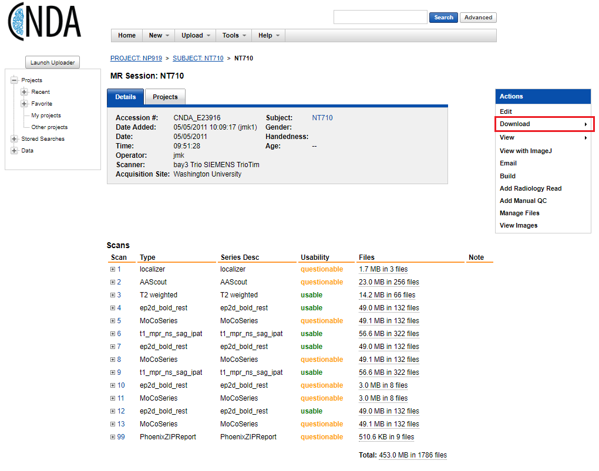
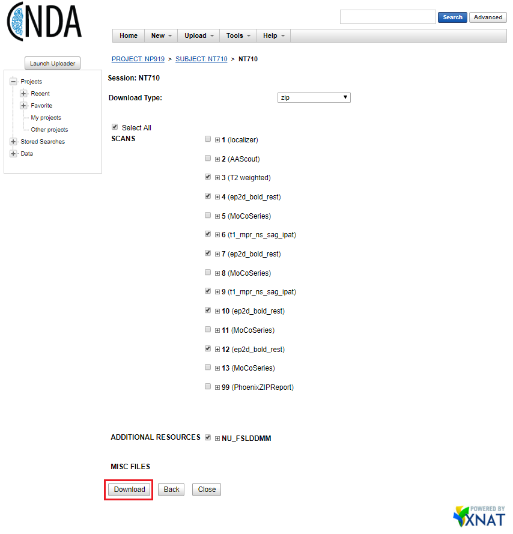
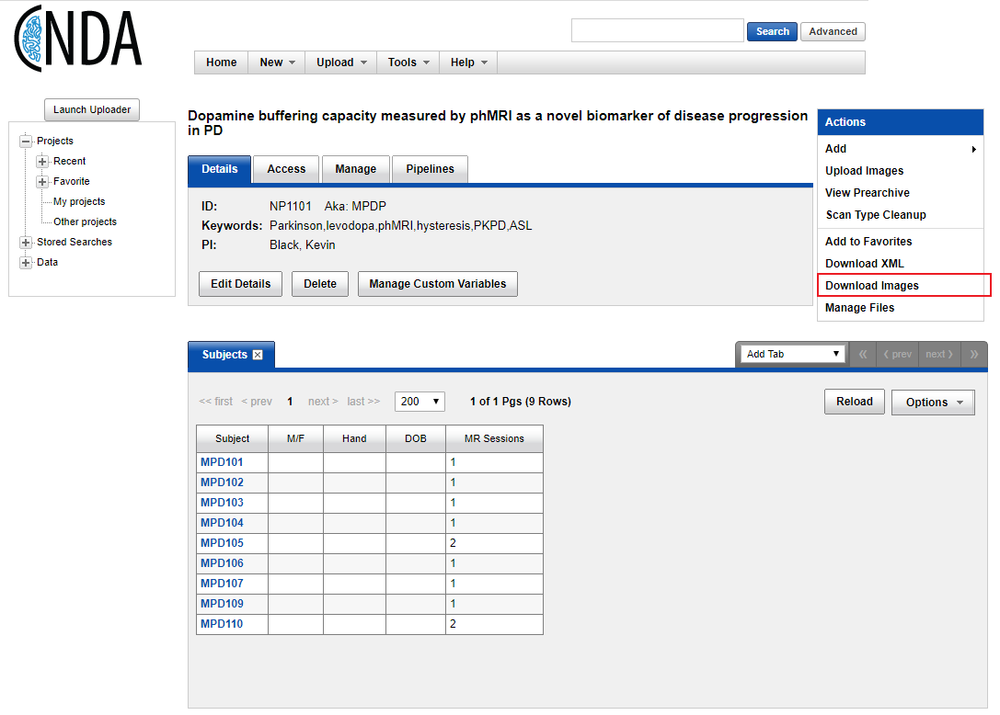
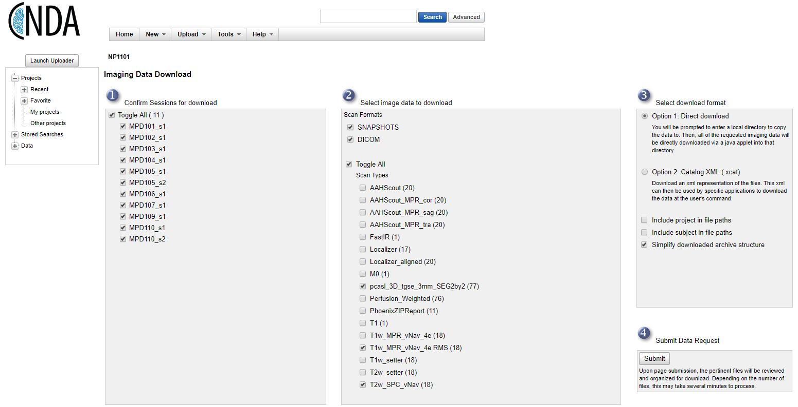
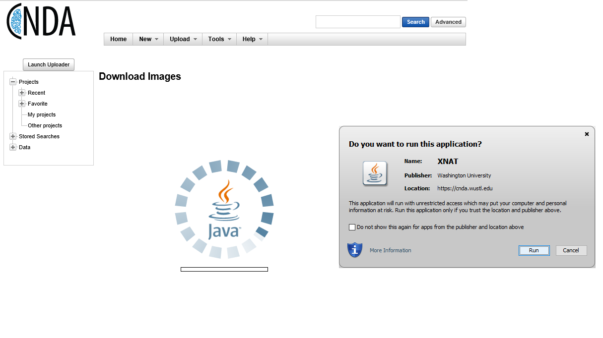
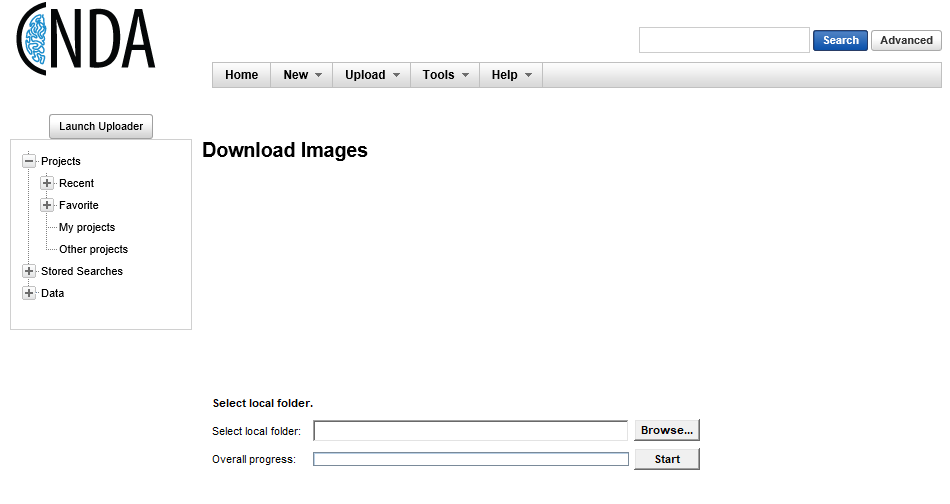

.. _cnda_download:

Downloading data from CNDA
---------------------------

There are 3 ways to download DICOM data from CNDA.

Manual download of a single subject
+++++++++++++++++++++++++++++++++++
You can download DICOM data for a single subject by navigating to a particular subject session and selecting the 'Download' option from the actions menu.

This will bring you to a page where you can select individual scans to download for a session.

Manual bulk download
++++++++++++++++++++
.. warning:: This Java applet will not work in Chrome; run from IE or other browser.

You can bulk download DICOM data for a project by navigating to the project page and selecting 'Download Images' from the actions menu.

This will bring you to a page where you can select scan types to download for multiple subjects. The defaults in step 3 should be sufficient.

The next screen will show a pop-up asking for permission to run the Java applet, choose 'Run'.

You will then choose a local folder to store the downloaded data before selecting 'Start' to begin the download.

API download
++++++++++++

Instuctions for using the XNAT REST API can be found on the `XNAT wiki <https://wiki.xnat.org/docs16/4-developer-documentation/using-the-xnat-rest-api/downloading-files-via-xnat-rest-api>`_
